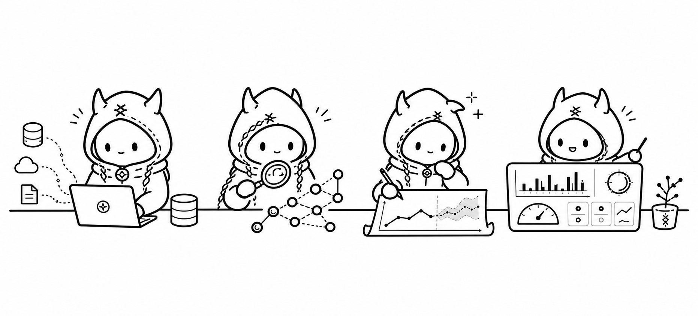

# norn



**Forecast any metric in your warehouse — and find out what moves it.**

Your dashboards tell you what already happened. norn tells you what happens
next, and why: it reads the marts you already build with dbt, produces
multi-segment forecasts with prediction intervals, discovers which metrics are
leading indicators of which, and serves all of it to AI agents over MCP and to
people through BI dashboards.

Think of it as a **forecasting layer for your data warehouse**:

- **Forecast any metric, across all segments at once** — quantile bands
  (`p10 / p50 / p90`) instead of a single guess.
- **Zero-shot accuracy out of the box** — Google's TimesFM 2.5 foundation
  model, or a dependency-free seasonal baseline. No ML infrastructure, no
  model training.
- **Know what drives your KPIs** — statistical lead/lag discovery finds which
  metrics move first, with LLM-written explanations; confirmed drivers feed
  back into forecasts as covariates.
- **Trust the numbers** — rolling-origin backtesting gives you coverage, WAPE
  and bias per segment before you rely on a forecast.
- **Built for AI agents** — 11 read-only MCP tools so Claude, bots and
  pipelines can ask "where is this metric heading?" directly.
- **Your domain, your rules** — the platform ships no built-in metrics or
  models; point it at your own marts and describe jobs in YAML.

Under the hood: `dbt → ClickHouse → forecast worker (baseline / TimesFM) →
Lightdash`, plus an MCP interface for agents. This repo is the **generic
platform** — it ships no domain defaults. Concrete domain instances (e.g. the
[`instances/ett`](instances/ett) ETT example) plug in ingestion, marts, jobs,
and dashboards from linked submodule repos.

## Quickstart (local)

```bash
uv sync
uv run norn up            # ClickHouse in Docker (local-dev convenience)
uv run norn schema-apply  # create the 5 forecast-contract tables
uv run norn forecast forecasts/example.yml   # run an abstract example job
```

`forecasts/example.yml` is an abstract example job (substitute your own
`metric: <your_metric>`, `source: <your_mart>`, `dimensions: [<dim>]`). The local
ClickHouse password is set via the `NORN_DB_PASSWORD` env var (env-only secret).

## Documentation

Full user guide lives in [`docs/guide/`](docs/guide/README.md):

- [Overview & architecture](docs/guide/overview.md) — what norn is, the data flow, the platform ↔ instance model.
- [Getting started](docs/guide/getting-started.md) — copy-pasteable local quickstart.
- [Configuration](docs/guide/configuration.md) — the config model: layers, env overrides, secrets, instance config dirs.
- [Jobs](docs/guide/jobs.md) — forecast/dependency job contracts, calibration, schema-ownership modes.
- [Forecast methodology](docs/guide/forecast/methodology.md) — how the forecasters work: baseline math, TimesFM, quantiles, calibration.
- [MCP](docs/guide/forecast/mcp.md) — connecting and the 11-tool reference for agents.
- [Deployment](docs/guide/deployment.md) — local Docker, the TimesFM worker, the long-running services (scheduler, MCP, agent worker), cloud/Kubernetes.
- Package reference — one page per package (description, functionality, configuration): [core](docs/guide/core/README.md) · [integration](docs/guide/integration/README.md) · [forecast](docs/guide/forecast/README.md) · [agent](docs/guide/agent/README.md) · [scheduler](docs/guide/scheduler/README.md).

Architecture deep-dive and integrations:

- [Architecture & data model](docs/erd/monorepo-and-data-model.md) — monorepo layout, the ER model of the contract tables, tech-stack rationale; canonical diagrams: [component](docs/erd/architecture.mermaid) and [ER](docs/erd/erd.mermaid).
- [Lightdash integration](docs/integration/lightdash.md) — publishing the actual-vs-forecast dashboards from the contract tables.

## Layout

- `packages/core` — config + job contracts (forecast-job, forecast-point) + ClickHouse client
- `packages/integration` — the canonical ClickHouse DDL (the 5 contract tables: `forecast_run`, `forecast_point`, `forecast_segment`, `metric_dependency`, `dependency_explanation`)
- `packages/forecast` — forecasters (`baseline-seasonal-naive` and `timesfm-2.5`), runner, the TimesFM HTTP worker, and the MCP server (11 tools)
- `packages/agent` — lead/lag dependency analysis (stats + LLM explanation) and the agent worker
- `packages/scheduler` — built-in cron scheduler (APScheduler from a `jobs.yml` manifest) + FastAPI control API (port `9300`)
- `cli` — the `norn` entrypoint (`schema-apply`, `print-schema`, `forecast`, `calibrate`, `deps`, `mcp`, `scheduler`, `up`)
- `instances/ett` — the public example instance (ETT — Electricity Transformer Temperature): ingestion, dbt marts (`mart_metric` / `fct_ot`), and forecast/deps jobs
- `instances/example` — the copyable template instance (settings, no data): config, example jobs (`forecasts/orders_baseline.yml`, `forecasts/orders_timesfm.yml`, `forecasts/deps/visits_orders.yml`), and a dbt skeleton
- `deploy/docker-compose.yml` — infra stack: local ClickHouse sidecar + optional Lightdash BI stack
- `deploy/docker-compose.services.yml` — norn's own services (`timesfm`, `scheduler`, `mcp`, `agent`), split into a separate file so taking services down can never remove the infra
- `deploy/timesfm.Dockerfile` — self-contained TimesFM forecast worker (port `9100`)

## Tests

Requires a local ClickHouse: `docker compose -f deploy/docker-compose.yml up -d clickhouse`,
then `uv run pytest`. The suite runs against an **isolated database** —
`norn_test` by default (created automatically). To use another DB, point
`NORN_CLICKHOUSE_URL` at it; the conftest **refuses** any database whose name
doesn't end in `_test`, because the suite truncates the tables it touches.

## Contributing

Contributions are welcome — the workflow is fork-based (you don't need any
branch in this repo):

1. **Issue first.** Pick an existing issue or open a new one and claim it
   before starting anything bigger than a small fix — so the design gets
   discussed before you invest time.
2. **Fork & branch.** Fork the repository, keep your fork's `main` synced with
   upstream, and create a topic branch in your fork
   (`feat/...` / `fix/...`).
3. **Conventional commits.** `<type>: <description>` — `feat:`, `fix:`,
   `docs:`, `refactor:`, `test:`, `chore:`, `perf:`, `ci:`.
4. **Open a PR against `main`.** Keep PRs small and focused; the core team
   reviews and **squash & merges** (your PR title becomes the commit, so make
   it a good conventional-commit line).
5. **Keep the platform domain-agnostic.** No domain hardcode in `packages/*`
   or `cli` — no built-in metrics, dimensions, ingestion formats, or prompts.
   Domain examples are allowed only in tests, docs, and `*example*` files;
   real domain logic belongs in an [instance](instances/example).
6. **Tests & docs.** Run the suite against an isolated ClickHouse (see above)
   and add coverage for what you change; if you change behavior, update the
   matching page under [`docs/guide/`](docs/guide/README.md). Everything —
   comments, docs, commits — in English.

## Inspiration

norn is inspired by what production forecasting takes at scale — e.g. Uber's
[Scaling Real-Time Traffic Forecasting with a Graph-Aware Transformer](https://www.uber.com/us/en/blog/scaling-real-time-traffic/)
(DeepETT): the hard parts are not the model but the operations around it —
calibration drift, freshness, and trust in the numbers. norn brings that
discipline to any warehouse on open components: quantile bands instead of point
guesses, rolling-origin backtesting before you rely on a forecast, and explicit
failure modes instead of silent fallbacks.

## License

[MIT](LICENSE). Notes:

- The platform is provided **as is**, without warranty of any kind (see the
  license text).
- Submodule instances and third-party components keep their own licenses —
  e.g. TimesFM weights (Apache-2.0, downloaded from Hugging Face at worker
  build/run time), Lightdash (MIT), dbt (Apache-2.0), ClickHouse (Apache-2.0).
  Datasets used by example instances carry their own terms (see the instance
  README, e.g. the ETT dataset license note).
